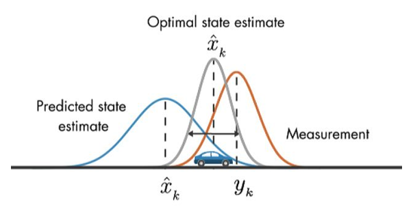
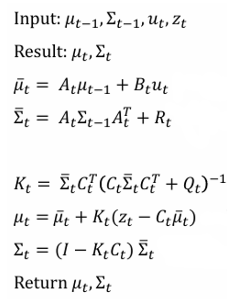
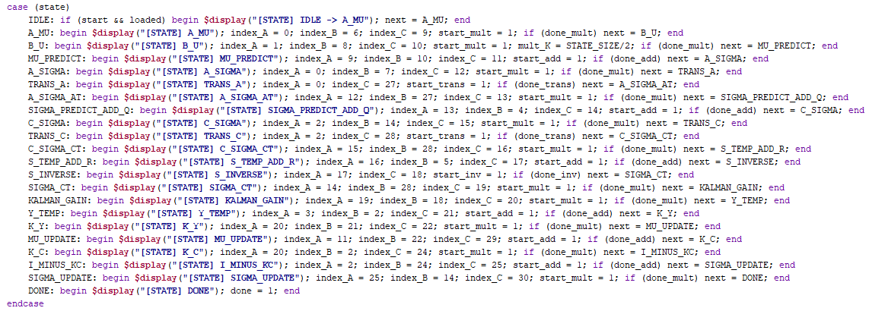
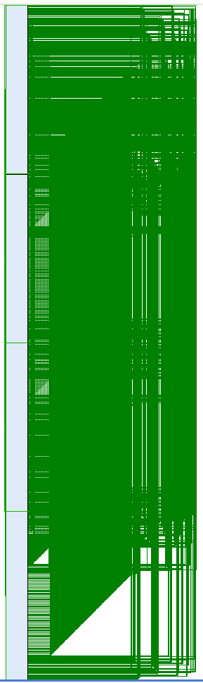
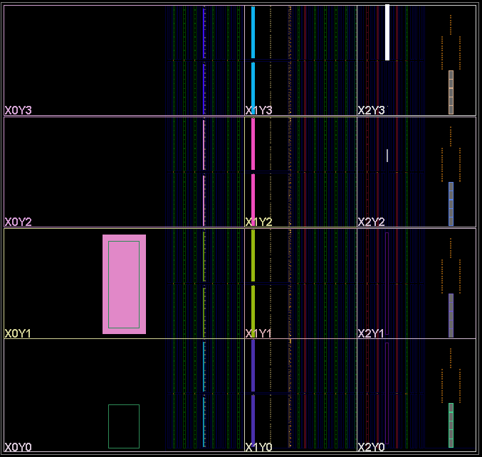
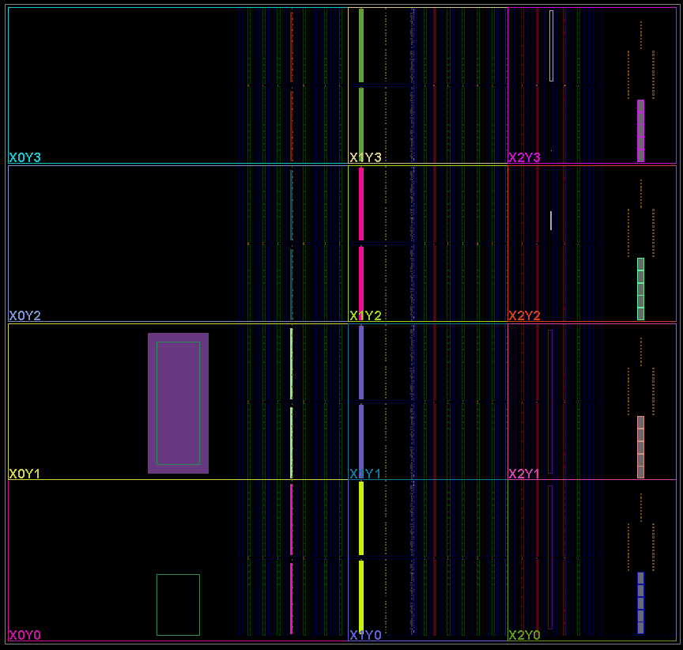
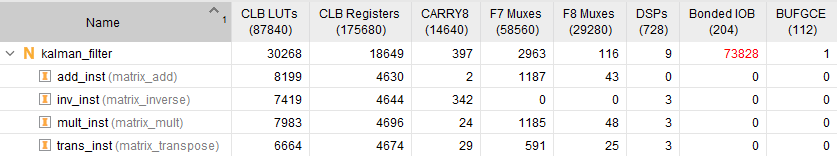
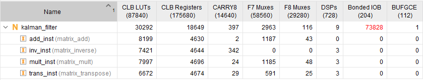

# Kalman Filter Design

### by 

## Intro
This repository gives a walk through on the complete design process of a Kalman Filter on an FPGA for various purposes. This report is divided into several sections:

0. [Necessary software and setup](#necessary-software-and-setup)
1. [Kalman Filter Design](#kalman-filter-design)
2. [RTL Kalman Filter Architecture](#rtl-kalman-filter-architecture)
    * Overview
    * Matrix Multiplication
    * Matrix Addition and Subtraction
    * Matrix Transpose
    * Matrix Inversion
3. [Filter Implementation and Testing](#filter-implementation-and-testing)
    * Description of how the filter will be tested, and what criteria will be measured:
        * performance
        * power
        * critical path timing
        * space/resource usage on FPGA will be analyzed
4. [Kalman Filter Results](#kalman-filter-results)
5. [Conclusion](#conclusion)

## Necessary software and setup

- [AMD Vivado](https://www.xilinx.com/support/download/index.html/content/xilinx/en/downloadNav/vivado-design-tools/2024-2.html)

## Kalman Filter Design

A Kalman Filter is used to help estimate the true state of a system given a predicted state and a noisy measured state. It does so by moving the previous state with a probabilistic model to guess the current state: giving us sigma believed and mu believed. After this, a Kalman gain is computed using these beliefs, and the noisy measurement matrix. From this Kalman gain, beliefs, noisy measurements, and previous state, the system can compute the actual state of the system. Kalman Filter's are great and handling gaussian noise in linear systems. However if non-gaussian noise is present or we are operating in a non-linear system, an Extended Kalman Filter may be better.
<div align="center">
  
  <br>
  <p>Figure 1: Kalman Filter Example </p>
</div>

The Kalman Filter has two main steps: the prediction step, and the update step. In addition, there are several matrixes important to the operation, which are shown in the table below:

<div align="center">
<table border="1" cellspacing="0" cellpadding="5">
<thead>
<tr>
<th>Pool Index</th>
<th>Matrix Name</th>
<th>Description</th>
<th>Size</th>
</tr>
</thead>
<tbody>
<tr><td>0</td><td><b>A</b></td><td>State transition matrix</td><td>(STATE_SIZE × STATE_SIZE)</td></tr>
<tr><td>1</td><td><b>B</b></td><td>Control input matrix</td><td>(STATE_SIZE × INPUT_SIZE)</td></tr>
<tr><td>2</td><td><b>C</b></td><td>Measurement matrix</td><td>(STATE_SIZE × STATE_SIZE)</td></tr>
<tr><td>3</td><td><b>z</b></td><td>Measurement vector</td><td>(STATE_SIZE × 1)</td></tr>
<tr><td>4</td><td><b>Q</b></td><td>Process noise covariance</td><td>(STATE_SIZE × STATE_SIZE)</td></tr>
<tr><td>5</td><td><b>R</b></td><td>Measurement noise covariance</td><td>(STATE_SIZE × STATE_SIZE)</td></tr>
<tr><td>6</td><td><b>mu_prev</b></td><td>Previous state estimate (μₖ₋₁)</td><td>(STATE_SIZE × 1)</td></tr>
<tr><td>7</td><td><b>Sigma_prev</b></td><td>Previous covariance estimate (Σₖ₋₁)</td><td>(STATE_SIZE × STATE_SIZE)</td></tr>
<tr><td>8</td><td><b>u</b></td><td>Control input vector</td><td>(INPUT_SIZE × 1)</td></tr>
</tbody>
</table>
Table 1: Matrix and Vector Definitions
</div>
</br>

From here, the prediction step calculates new sigma and mu beliefs using the previous system states sigma and mu, the state transition matrix A, and control input matrix B. With the beliefs calculated, measurement matrix C and noise matrix Q are used with said beliefs to calculate the Kalman Gain. With this Kalman Gain, our beliefs, and the measurement + noise matrices, we can then calculate our actual state for sigma and mu. (sigma being the state estimate, and mu the covariance estimate). This process is shown in Figure 2 below.

<div align="center">
  
  <br>
  <p>Figure 2: Kalman Filter Steps </p>
</div>

## RTL Kalman Filter Architecture

### Overview

To make implementing the Kalman Filter easier, I have split it up into several subsections. As everything is matrix or vector based, I had to come up with my own dynamic RTL implementations for the following:
- Matrix multiplication
- Matrix addition/subtraction
- Matrix transpose
- Matrix inverse

By developing these subcomponents, I can assemble them into a top-level Kalman Filter module that performs all steps of the algorithm. A simple scheduler will manage the execution of each component, ensuring that we do not need multiple adders, multipliers, etc. When needed, each component can be called and given an updated size to adjust to (i.e. 4x4 times 4x2 matrix, maybe 4x4 times 4x1, etc.). Since most Kalman Filters for physical systems do not require operation above 1kHz, extensive internal pipelining is unnecessary—as long as each step can complete within a single clock cycle. However, maintaining low latency remains critical, as delays in estimation can introduce significant issues in control applications.

In addition, a shared resource called the matrix_pool is used to store all matrices in memory. This reduces I/O interactions, and also lets us keep a log of our calculations. Each matrix that is calculated is listed in Table 2 below (note, everything up to and including pool 8 is loaded in from memory):

<div align="center">
<table border="1" cellspacing="0" cellpadding="5">
<thead>
<tr>
<th>Pool Index</th>
<th>Matrix Name</th>
<th>Description</th>
<th>Size</th>
</tr>
</thead>
<tbody>
<tr><td>0</td><td><b>A</b></td><td>State transition matrix</td><td>(STATE_SIZE × STATE_SIZE)</td></tr>
<tr><td>1</td><td><b>B</b></td><td>Control input matrix</td><td>(STATE_SIZE × INPUT_SIZE)</td></tr>
<tr><td>2</td><td><b>C</b></td><td>Measurement matrix</td><td>(STATE_SIZE × STATE_SIZE)</td></tr>
<tr><td>3</td><td><b>z</b></td><td>Measurement vector</td><td>(STATE_SIZE × 1)</td></tr>
<tr><td>4</td><td><b>Q</b></td><td>Process noise covariance</td><td>(STATE_SIZE × STATE_SIZE)</td></tr>
<tr><td>5</td><td><b>R</b></td><td>Measurement noise covariance</td><td>(STATE_SIZE × STATE_SIZE)</td></tr>
<tr><td>6</td><td><b>mu_prev</b></td><td>Previous state estimate (μₖ₋₁)</td><td>(STATE_SIZE × 1)</td></tr>
<tr><td>7</td><td><b>Sigma_prev</b></td><td>Previous covariance estimate (Σₖ₋₁)</td><td>(STATE_SIZE × STATE_SIZE)</td></tr>
<tr><td>8</td><td><b>u</b></td><td>Control input vector</td><td>(INPUT_SIZE × 1)</td></tr>
<tr><td>9</td><td><b>A × mu_prev</b></td><td>Predicted dynamics contribution</td><td>(STATE_SIZE × 1)</td></tr>
<tr><td>10</td><td><b>B × u</b></td><td>Predicted control input contribution</td><td>(STATE_SIZE × 1)</td></tr>
<tr><td>11</td><td><b>mu_predict</b></td><td>Predicted state estimate (Aμ + Bu)</td><td>(STATE_SIZE × 1)</td></tr>
<tr><td>12</td><td><b>A × Sigma_prev</b></td><td>Intermediate for covariance prediction</td><td>(STATE_SIZE × STATE_SIZE)</td></tr>
<tr><td>13</td><td><b>A Σ Aᵀ (temp)</b></td><td>Temp for Σₖ⁻ calculation</td><td>(STATE_SIZE × STATE_SIZE)</td></tr>
<tr><td>14</td><td><b>Sigma_predict</b></td><td>Predicted covariance (Σₖ⁻)</td><td>(STATE_SIZE × STATE_SIZE)</td></tr>
<tr><td>15</td><td><b>C × Sigma_predict</b></td><td>Intermediate for innovation covariance</td><td>(STATE_SIZE × STATE_SIZE)</td></tr>
<tr><td>16</td><td><b>C Σ Cᵀ (temp)</b></td><td>Temp before adding R</td><td>(STATE_SIZE × STATE_SIZE)</td></tr>
<tr><td>17</td><td><b>S_temp</b></td><td>Innovation covariance before inversion</td><td>(STATE_SIZE × STATE_SIZE)</td></tr>
<tr><td>18</td><td><b>S_inverse</b></td><td>Inverse of innovation covariance (S⁻¹)</td><td>(STATE_SIZE × STATE_SIZE)</td></tr>
<tr><td>19</td><td><b>Sigma_predict × Cᵀ</b></td><td>Intermediate for Kalman Gain</td><td>(STATE_SIZE × STATE_SIZE)</td></tr>
<tr><td>20</td><td><b>K</b></td><td>Kalman Gain matrix (K)</td><td>(STATE_SIZE × STATE_SIZE)</td></tr>
<tr><td>21</td><td><b>y_temp</b></td><td>Innovation error (z - Cμ)</td><td>(STATE_SIZE × 1)</td></tr>
<tr><td>22</td><td><b>K × y_temp</b></td><td>Correction term</td><td>(STATE_SIZE × 1)</td></tr>
<tr><td>23</td><td>*unused*</td><td>Reserved slot</td><td>-</td></tr>
<tr><td>24</td><td><b>K × C</b></td><td>Kalman gain × Measurement matrix</td><td>(STATE_SIZE × STATE_SIZE)</td></tr>
<tr><td>25</td><td><b>I - KC</b></td><td>Identity minus Kalman correction term</td><td>(STATE_SIZE × STATE_SIZE)</td></tr>
<tr><td>26</td><td><b>Sigma_new</b></td><td>Updated covariance Σₖ</td><td>(STATE_SIZE × STATE_SIZE)</td></tr>
<tr><td>27</td><td><b>Aᵀ</b></td><td>Transpose of A (for AΣAᵀ)</td><td>(STATE_SIZE × STATE_SIZE)</td></tr>
<tr><td>28</td><td><b>Cᵀ</b></td><td>Transpose of C (for CΣCᵀ)</td><td>(STATE_SIZE × STATE_SIZE)</td></tr>
<tr><td>29</td><td><b>mu_new</b></td><td>Updated state estimate (μₖ)</td><td>(STATE_SIZE × 1)</td></tr>
<tr><td>30</td><td>*optional*</td><td>Backup or overflow slot</td><td>-</td></tr>
</tbody>
</table>
Table 2: All matrixes present in KF calculation for my implementation.
</div>

Due to the nature of this pool system, the Kalman Filter must be naturally pipelined inbetween every major matrix operation. Figure 3 shows how the program is divided up into several smaller matrix operation blocks, each of which must happen individually. In practice, this filter essentially operaties like a Finite State Machine in order to respect the modular system due to the limited matrix operation units. As such, the critical path of this implementation is equal to the most time consuming matrix operation in the process. In addition, this Kalman Filter will require the user to input data in 16-bit fixed point representation. This avoids any overheard of dealing with floating point numbers.

<div align="center">
  
  <br>
  <p>Figure 3: Kalman Filter FSM</p>
</div>

Lastly, this dynamic nature will help with the 3 state size implementations we want to test: 4-state (Simple 2D state modeling), 6-state (Simple 3D state modeling), 12-state (Complex 3D state modeling).

### Matrix Multiplication
To implement matrix multiplication, I went with a straightforward algorithm which iterates through every row-column pair between both matrices, and sums together the multiplication of each index in the row-column pair. The nice thing about this implementation is that each row-column pair can happen in parallel, making our run time limited to just the shared size of both matrices plus an accumulate step (i.e. for an MxN times NxK system, our runtime is O(N + 1)). 

### Matrix Addition
This is straightforward implementation as well, we just iterate through every index of both matrices, summing each value into the index of a third output matrix in the matrix_pool. For subtraction, just negate all values in the second input matrix.

### Matrix Transpose
This is straightforward implementation as well, we just iterate through every index of the matrix in a row-column fashion, and copy over into an output matrix in column-row fashion.

### Matrix Inverse
This is not straightforward to implement. Several matrix inversion methods were considered, including Gauss-Jordan elimination, adjugate methods, Cholesky decomposition, and iterative refinement algorithms. Gauss-Jordan elimination was rejected due to its requirement for complex pivoting and division operations. These are very resource-intensive and difficult to manage efficiently in hardware. The adjugate method is avoided because it's computationally infeasible for matrices larger than 3x3. This is because it relies on minor determinants for computation. Cholesky decomposition, while efficient, is only applicable to symmetric positive definite (SPD) matrices. The property for matrices to be SPD cannot be guaranteed for all Kalman Filter matrices under fixed-point arithmetic. Iterative methods were excluded due to their high latency and lack of guaranteed convergence. As a result, LU decomposition was selected for matrix inversion, offering an optimal balance between computational efficiency, stability, and suitability for RTL hardware implementation. Furthermore, LU decomposition aligns closely with the step-by-step nature of hardware state machines, allowing for an efficient and deterministic RTL design.

LU decomposition simplifies matrix inversion by breaking a matrix A into two parts: a lower triangular matrix L and an upper triangular matrix U, such that A=LU. This makes solving systems like Ax=b easier because it reduces to two simpler steps:
- First, solve Ly=b (forward substitution),
- Then, solve Ux=y (backward substitution).

This two-stage approach avoids complex direct inversion and relies only on addition and multiplication operations, making it highly suitable for efficient RTL hardware implementation.

## Filter Implementation and Testing

### Implementation

All filter's were developed in AMD's Vivado software using System Verilog. ```.mem``` files are used to store matrices, and to also store input data for testbench files. The Kalman Filter processes matrices with up to 16-bit input signal. For operations like multiplication, a 16 bit shift to the right is applied to offset the increase to 32 bits. All other operations do not require any bit shifting.

For the main file, there is an enum set up to track the state we are in (i.e. computing A * previous mu in prediction step, doing matric inversion in update step, etc.) to make sure we are stepping through the filter correctly. In addition, each matrix operation only has one instance created, where the instances can be dynamically updated to support operations for 12-state, 6-state, or 4-state systems. Using the adjustable sizing explained in the previous section helps to execute this. In turn, we limit the number of modules we need, and the size of our hardware/resource utilization.

### Test Data
For the testbench to work, they require input data. This input data is generated using the script [mem_gen.py](mem_gen.py). This script generates the 9 essential matrices needed to perform Kalman Filtering, shown in Table 1. 

### Testing criteria (and how to derive)
Two schematics and Four criteria will be tested for:
* Filter Schematic
    * Question: What does our filter schematic look like? Does it match our design schematic?
    * Run: n the flow navigator run "RTL Analysis," then select "Schematic" under "Open Elaborated Design" in the "RTL Analysis" dropdown.
* Device Layout on FPGA
    * Question: What does our filter look like on the FPGA? The white line represents the critical path.
    * Run: In the flow navigator, run "Implementation." Device layout should open up after implementation is complete.
* Behavioral Simulation
    * Question: How does the filter respond to the input signal?
    * Run: In the flow navigator left-click "Run Simulation." The testbench will print output results to the TCL terminal
* Timing
    * Question: What is critical path of the filter?
    * Run: To find this, we run the command ```report_timing -delay_type max -path_type full``` in the tcl terminal. This will return a report with the path offending the lowest "slack" time. The slack time is the difference between the clock cycle and critical path. To find the critical path from this, we look for the "data path delay."
* Area / Resource Utilization
    * Question: How many resources on the FPGA are used? Rough conversion to area using this equation: $A_{\text{FPGA}} \approx (0.0002 \times U_{\text{LUT}}) + (0.0001 \times U_{\text{FF}}) + (0.03 \times U_{\text{DSP}}) + (0.02 \times U_{\text{IO}}) + (0.00015 \times U_{\text{Carry8}}) + (0.0001 \times U_{\text{F7}}) + (0.0001 \times U_{\text{F8}})$ with the following sizes arbitrarily chosen by ChatGPT: 
    * | Resource | mm^2 |
      |----------|-------:|
      | LUTs     | 0.0002 |
      | FFs      | 0.0001 |
      | DSPs     | 0.03   |
      | IOs      | 0.02   |
      | Carry8   | 0.00015|
      | F7 Muxes | 0.0001 |
      | F8 Muxes | 0.0001 |
    * Run: In the flow navigator, run "Implementation." After the implementation completes, in the console select "Utilization."

> [!NOTE]  
> I intended to show power too, but Vivado was reluctant to generate any power graphs. I let the tool run for 20 minutes, and it was still stuck on loading power graphs for each state size. In addition, Kalman Filter with size 12 would not finish synthesis. I was able to run behavioral sims and the linter to get functionality+schematic results, but could not generate area, timing, or power reports for these.

## Kalman Filter Results

### Circuit Schematic

<div align="center">
  
  <br>
  <p>Figure 4: 4-State Kalman Filter RTL Schematic</p>
</div>

<br>

Tough to see with so many connections, but it is clear that there are 4 modules on the left that all operations are sourced to! The schematics from the linter for the 6 and 12 state versions looked similar.

### Device Layout on FPGA

<div align="center">
  
  <br>
  <p>Figure 5: 4-State Kalman Filter on FPGA</p>
</div>

<div align="center">
  
  <br>
  <p>Figure 6: 6-State Kalman Filter on FPGA</p>
</div>

<br>

No major comments. Resource utilization from this device layout seems minimal, and the critical path on both implementations is located in a small segment on the top right of the device.

### Behavioral Sim

Individual matrix operations perform as expected, but the filter itself returned an undefined mu state. Sigma and Kalman Gain output values match local python simulation output. I set the constraint to clock at about 50kHz, and the filter was able to keep up with that speed, with a low latency as small as 200ns!

### Timing

4-State System Timing:
```
Copyright 1986-2022 Xilinx, Inc. All Rights Reserved. Copyright 2022-2024 Advanced Micro Devices, Inc. All Rights Reserved.
--------------------------------------------------------------------------------------------------------------------------------------------------
| Tool Version      : Vivado v.2024.2 (win64) Build 5239630 Fri Nov 08 22:35:27 MST 2024
| Date              : Sat Apr 26 03:43:15 2025
| Host              : Amars-XPS running 64-bit major release  (build 9200)
| Command           : report_timing -delay_type max -path_type full
| Design            : kalman_filter
| Device            : xczu4ev-fbvb900
| Speed File        : -2  PRODUCTION 1.30 05-15-2022
| Design State      : Synthesized
| Temperature Grade : I
--------------------------------------------------------------------------------------------------------------------------------------------------

Timing Report

Slack:                    inf
  Source:                 inv_inst/i_reg[2]/C
                            (rising edge-triggered cell FDRE)
  Destination:            inv_inst/matrix_pool_reg[0][101][14]/D
  Path Group:             (none)
  Path Type:              Max at Slow Process Corner
  Data Path Delay:        23.413ns  (logic 12.144ns (51.869%)  route 11.269ns (48.131%))
  Logic Levels:           204  (CARRY8=163 FDRE=1 LUT1=2 LUT2=2 LUT4=32 LUT5=1 LUT6=3)
```
<br>
6-State System Timing

```
Copyright 1986-2022 Xilinx, Inc. All Rights Reserved. Copyright 2022-2024 Advanced Micro Devices, Inc. All Rights Reserved.
--------------------------------------------------------------------------------------------------------------------------------------------------
| Tool Version      : Vivado v.2024.2 (win64) Build 5239630 Fri Nov 08 22:35:27 MST 2024
| Date              : Sat Apr 26 04:36:23 2025
| Host              : Amars-XPS running 64-bit major release  (build 9200)
| Command           : report_timing -delay_type max -path_type full
| Design            : kalman_filter
| Device            : xczu4ev-fbvb900
| Speed File        : -2  PRODUCTION 1.30 05-15-2022
| Design State      : Synthesized
| Temperature Grade : I
--------------------------------------------------------------------------------------------------------------------------------------------------

Timing Report

Slack:                    inf
  Source:                 inv_inst/i_reg[2]/C
                            (rising edge-triggered cell FDRE)
  Destination:            inv_inst/matrix_pool_reg[0][101][14]/D
  Path Group:             (none)
  Path Type:              Max at Slow Process Corner
  Data Path Delay:        23.331ns  (logic 12.202ns (52.300%)  route 11.129ns (47.700%))
  Logic Levels:           205  (CARRY8=165 FDRE=1 LUT1=2 LUT2=2 LUT3=1 LUT4=31 LUT5=1 LUT6=2)
```

The critical path per the report is 23.331ns to 23.413ns on the FPGA. A majority of this time (about 11ns) is due to the physical route that is taken on the FPGA. The logic only takes 12ns. We can also see that this occurred on the inverse matric process, which is the most computationally intensive. Given the low delay, it means LU decomposition is working pretty well for 4x4 and 6x6 matrices. In fact, it looks to be the same path size for both! This location of the critical path aligns with where I would expect the critical path to be.

### Area / Resource Utilization

<div align="center">
  
  <br>
  <p>Figure 7: 4-State Kalman Filter Resource Utilization</p>
</div>
<div align="center">
  
  <br>
  <p>Figure 8: 6-State Kalman Filter Resource Utilization</p>
</div>
<br>

For both state space sizes, we can see that quite a few LUTs and CLB registers are used in this implementation. Interestingly enough, very few DSPs are utilizized, but this is most likely due to favoring of using the Carry8, F7, and F8 Muxes on this chip. All matrix method implementations had similar resource usage, with the inverse choosing to use more Carry8 cores than any other matrix method. This goes to show how computationally complex that computing the inverse can be. None the less, LU decomp makes this more efficient than normal inverse implementations.

One interesting thing to note is the use of the Bonded IOB on the kalman_filter upper level. This is due to needing to make a raw IO interface for the whole matrix pool. However, within all the modules, no additional IO is used, showing that the matrix pool acts like internal memory for the Kalman Filter as no additional IO links are necessary.

Lastly, the resource utilization for both state sizes is pretty similar. This can be explained due to the matrix math modules being setup to handle sizes of up to 12 state at all times. For smaller state inputs, some of these resources are still present, but just never used.

## Conclusion

In conclusion, I was not able to test all configurations of the Kalman Filter like I would've hoped to. Vivado took too long to synthesis the 6 and 12 state representations, and would sometimes crash. I believe the root cause for this is that my modular implementation of the filters, alongside the size of resources like the matrix_pool, proved to be too complex and demanding to execute. Trying to optimize everything to only use one unit each for multiplication, addition, transpose, and inverse *while* trying to make it so that each unit can accept matrices and vectors of dynamic sizing proved to be unoptimal in the long run. 

I believe a better scope for this project may have been attempting to focus on just optimizing these individual modules themselves, specifically the LU decomposition module. It would've been interesting to see how the other methods would stack up against LU decomp, and to also help further validate the findings of the papers which mentioned this method. Speaking of papers, I also now understand why every single Kalman Filter implementation on an FPGA utilized an external component for matrix operations: it makes implementation and life a lot simpler, and allows one to focus more on the Kalman Filter algorithm instead of "simple" mathematical operations. In addition, it would make it easier to debug why my mu output was not matching my python simulation output; as one potential failure could be my algorithm implemnentation themselves.

Overall, the basic 4-state and 6-state representations were pretty fast, low latency, and utilized little resources for the size of systems (4x4 matrix times 16 bits => 256 bit stream for one matrix) that were being modelled. 